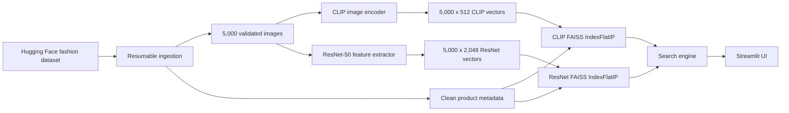
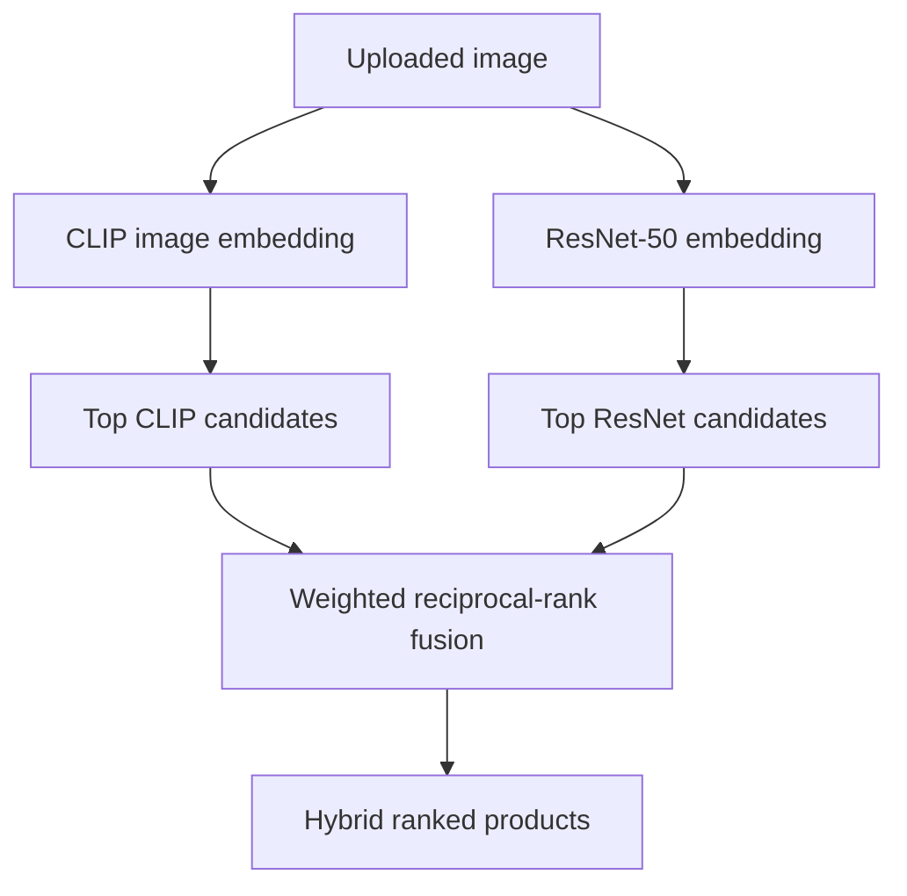
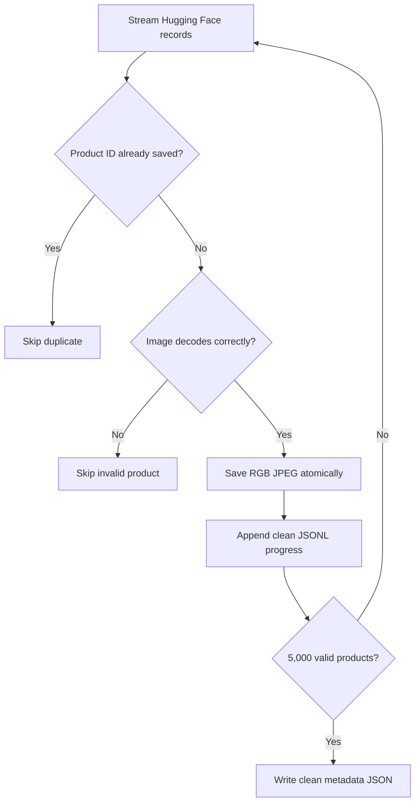
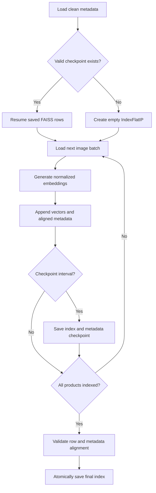

# Fashion Image Retrieval Engine

A local fashion-product search engine supporting:

- Text-to-image retrieval with CLIP
- Image-to-image retrieval with CLIP
- Image-to-image retrieval with ResNet-50
- Hybrid CLIP and ResNet-50 retrieval
- Exact vector search with FAISS
- A Streamlit interface for interactive testing

The current catalog contains **5,000 validated fashion products**. The original
100-product index is preserved as a backup.

## System overview



## Retrieval methods

### 1. CLIP text-to-image search

Model: `openai/clip-vit-base-patch32`

CLIP encodes text and images into the same 512-dimensional semantic vector
space. This allows a natural-language query to be compared directly with every
indexed product image.


Example queries:

```text
black men's shoes
red women's handbag
blue casual shirt
silver wrist watch
green traditional kurta
```

### 2. CLIP image-to-image search

An uploaded image is processed by CLIP's image encoder. Its vector is searched
against the same CLIP image index used by text retrieval.

CLIP is useful for **semantic similarity**: it tends to recognize the type and
meaning of a product even when its exact visual appearance differs.


### 3. ResNet-50 image-to-image search

Model: TorchVision `resnet50`

Weights: `IMAGENET1K_V2`

The final classification layer is removed. The global average-pooled output is
used as a 2,048-dimensional visual feature vector and L2-normalized before it is
stored in FAISS.

ResNet is useful for **visual similarity**, including shape, texture, pattern,
and appearance. It does not encode text, so it cannot perform text-to-image
search by itself.


### 4. Hybrid image retrieval

Hybrid is the recommended image-search mode. It combines CLIP's semantic
ranking with ResNet's visual ranking using weighted reciprocal-rank fusion.

Current weights:

- CLIP: `40%`
- ResNet-50: `60%`

The engines first retrieve a wider candidate set independently. Their ranks are
then fused:

```text
RRF(product) = 0.4 / (60 + CLIP rank)
             + 0.6 / (60 + ResNet rank)
```

Because fusion uses ranks rather than raw similarities, CLIP and ResNet scores
do not need to have identical numerical distributions.



## Model comparison

| Method | Input | Dimension | Strength | Limitation |
|---|---|---:|---|---|
| CLIP text | Text | 512 | Natural-language semantic search | Some fine-grained attributes can be missed |
| CLIP image | Image | 512 | Semantic visual similarity | May overlook small texture differences |
| ResNet-50 | Image | 2,048 | Shape, texture and appearance | Cannot understand text queries |
| Hybrid | Image | Both | Balances semantic and visual similarity | Loads both models and costs more CPU/RAM |

## FAISS similarity search

Both indexes use `faiss.IndexFlatIP`.

Every embedding is normalized to vector length 1. For normalized vectors, inner
product is equivalent to cosine similarity:

```text
cosine_similarity(a, b) = a · b
```

`IndexFlatIP` performs exact search, requires no training, and is appropriate
for the current 5,000-product catalog.

## Dataset ingestion

Dataset: `ashraq/fashion-product-images-small`

Split: `train`



The ingestion pipeline:

- Avoids duplicate product IDs
- Verifies saved image files
- Skips corrupted images safely
- Saves progress after each accepted product
- Resumes without redownloading valid images
- Writes final metadata atomically

## Checkpointed indexing



Each metadata record contains `index_position`. The following invariant is
validated before final persistence:

```text
FAISS vector N <-> indexed metadata record N <-> index_position N
```

## Current validated artifacts

| Artifact | Count | Dimension |
|---|---:|---:|
| CLIP FAISS index | 5,000 | 512 |
| ResNet-50 FAISS index | 5,000 | 2,048 |
| Indexed metadata | 5,000 | — |
| Original CLIP backup | 100 | 512 |

Validated vector norm ranges:

```text
CLIP:   0.9999998 to 1.0000002
ResNet: 0.9999998 to 1.0000001
```

## Project structure

```text
image-retrieval-engine/
├── app/
│   ├── config.py
│   ├── dataset_loader.py
│   ├── ingestion.py
│   ├── embedding_model.py
│   ├── resnet_embedding_model.py
│   ├── indexer.py
│   ├── scalable_indexer.py
│   ├── resnet_indexer.py
│   ├── search_engine.py
│   ├── resnet_search_engine.py
│   └── hybrid_search_engine.py
├── scripts/
│   ├── inspect_dataset.py
│   ├── test_embeddings.py
│   ├── build_index.py
│   ├── build_large_index.py
│   ├── build_resnet_index.py
│   └── test_search.py
├── ui/
│   └── streamlit_app.py
├── data/
│   ├── images/
│   ├── indexes/
│   └── metadata/
├── requirements.txt
└── README.md
```

## Installation

Create and activate a virtual environment, then install the dependencies:

### Windows PowerShell

```powershell
python -m venv .venv
.\.venv\Scripts\Activate.ps1
pip install -r requirements.txt
```

### Linux or macOS

```bash
python -m venv .venv
source .venv/bin/activate
pip install -r requirements.txt
```

## Build the data and indexes

Run commands from the project root.

Inspect the initial 100 products:

```bash
python -m scripts.inspect_dataset
```

Verify CLIP embeddings:

```bash
python -m scripts.test_embeddings
```

Build or resume the 5,000-product CLIP index:

```bash
python -m scripts.build_large_index --target 5000
```

The scalable pipeline can also be split into two stages:

```bash
python -m scripts.build_large_index --target 5000 --ingest-only
python -m scripts.build_large_index --target 5000 --index-only
```

Build or resume the ResNet-50 index:

```bash
python -m scripts.build_resnet_index
```

Test retrieval from the terminal:

```bash
python -m scripts.test_search
```

## Run the Streamlit application

```bash
python -m streamlit run ui/streamlit_app.py
```

Open `http://localhost:8501`, or forward port `8501` when the project runs in a
remote development workspace.

The interface provides:

- CLIP text-to-image search
- Hybrid image search by default
- Independent CLIP and ResNet image-search modes
- Adjustable result count
- Ranked images and product metadata
- Model-specific technical ranking details

## Next development phase

The next step is retrieval evaluation rather than UI expansion:

1. Create a versioned query evaluation set.
2. Define category, colour and gender relevance labels.
3. Measure Precision@5, Precision@10, Recall@5 and Recall@10.
4. Compare CLIP, ResNet and Hybrid image retrieval.
5. Add metadata-aware reranking and measure the change.
6. Benchmark a fashion-specific vision-language model.

